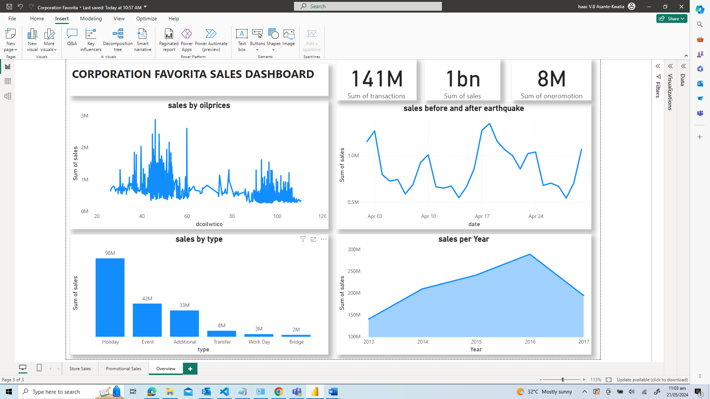
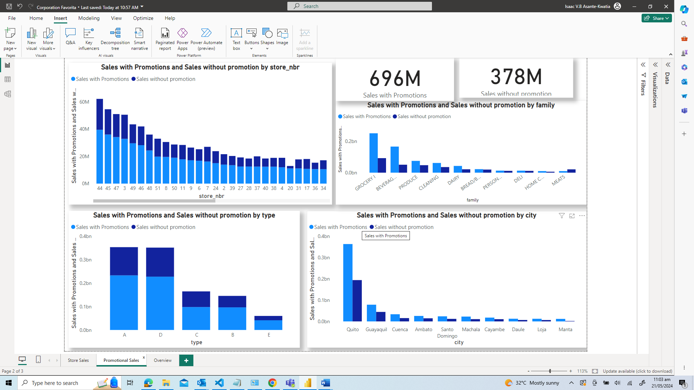
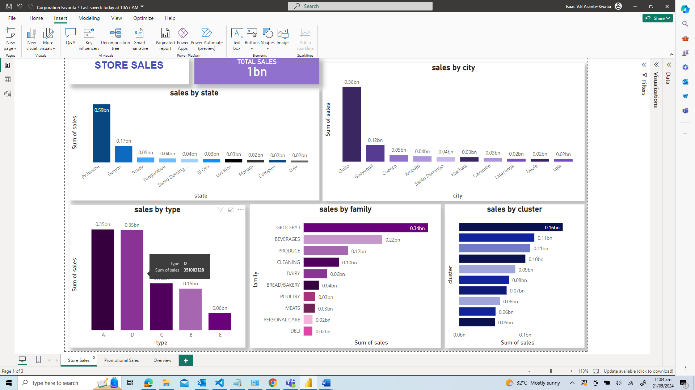

# Time-Series-Regression-Analysis
Predicting store sales using machine learning models to forecast demand for products at various locations for a grocery retailer

**Project Scenario**

You are a data scientist in Corporation Favorita, a large Ecuadorian-based grocery retailer. Corporation Favorita wants to ensure that they always have the right quantity of products in stock. To do this you have decided to build a series of machine learning models to forecast the demand of products in various locations. The marketing and sales team have provided you with some data to aid this endeavor. Your team uses CRISP-DM Framework for Data Science projects

**Problem Statement**

Corporation Favorita aims to optimize its inventory management by accurately forecasting the demand for various products across its stores in Ecuador. The goal is to ensure that each store has the right quantity of products in stock to meet customer demand while minimizing overstocking or stockouts
    
**Objective**

The objective is to build machine learning models that can predict unit sales for different product families at Favorita stores accurately. These models will help optimize inventory levels, improve sales forecasting accuracy, and ultimately enhance customer satisfaction by ensuring product availability.

**Key Stakeholders**

Stakeholders include Corporation Favorita's management, sales and marketing teams, store managers, and data science team.

